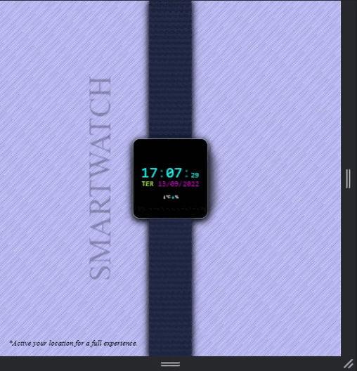

# Smartwatch with location dates ⏰⌚

## A digital clock with location to receive data. Its structure was entirely created in CSS.

 

This project was created based on the <a href="https://www.youtube.com/watch?v=WOxS0uiVyMg&t=448s">youtube video</a>.

⏰⌚

 

### In this work I was able to practice:

* HTML5
* CSS3
* JavaScript

This project is responsive.

 

